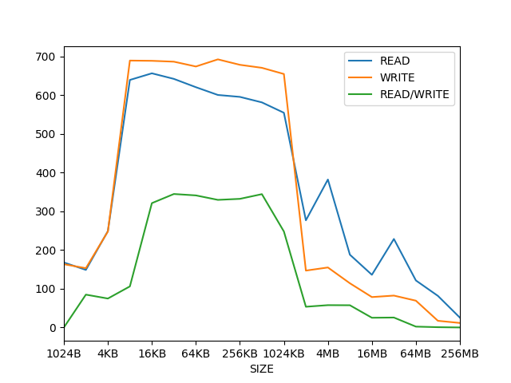

#  Assignment: Benchmarking the memory subsystem

## Bandwidth

For the code I've written to do the following, only the write bandwidth part feels like it was optimal, the rest could've been done better, but I've sunk a lot of time into trying to do it via inline assembly, which I've found disables a bunch of optimizations the compiler would've otherwise done (and also an annoying bug in LLVM which wouldn't let me move vectors to AVX registers.), I've elected to submit the best performing code I had written thus far.

## Results

### Graph



### Raw Data

| SIZE   | READ      | WRITE     | READ/WRITE | 
|--------|-----------|-----------|------------| 
| 1024B  | 167.80211 | 163.30383 | 0          | 
| 2KB    | 148.63286 | 153.09755 | 84.795746  | 
| 4KB    | 248.75266 | 247.78432 | 74.709305  | 
| 8KB    | 639.09174 | 689.10187 | 106.05232  | 
| 16KB   | 656.2047  | 688.48584 | 321.0145   | 
| 32KB   | 641.8074  | 686.2376  | 344.58896  | 
| 64KB   | 620.38153 | 673.79456 | 340.9828   | 
| 128KB  | 600.30475 | 692.22034 | 329.44476  | 
| 256KB  | 595.3505  | 678.1529  | 332.07684  | 
| 512KB  | 581.13873 | 670.3958  | 344.2085   | 
| 1024KB | 554.3486  | 654.45013 | 247.82353  | 
| 2MB    | 276.6618  | 146.83054 | 53.50501   | 
| 4MB    | 381.99097 | 154.91478 | 57.620335  | 
| 8MB    | 187.89914 | 114.1134  | 57.369526  | 
| 16MB   | 136.01678 | 78.47253  | 25.08674   | 
| 32MB   | 228.4758  | 82.31083  | 25.631512  | 
| 64MB   | 121.37392 | 69.16263  | 2.2027442  | 
| 128MB  | 81.59276  | 17.227228 | 0.73068583 | 
| 256MB  | 25.325344 | 11.642367 | 0.03680573 | 

## Code

Following is the code that answers all of the 4 questions -

```rust
#![feature(core_intrinsics, asm)]

use std::time::Instant;
use packed_simd::{u64x4};
use std::thread;
use std::fmt;
use std::fs::File;
use std::io::Write;

const NUM_LOOPS_1: usize = 100_000;
const NUM_LOOPS_2: usize = 10_000;
const NUM_LOOPS_3: usize = 1_000;
const NUM_LOOPS_4: usize = 100;

const START_SIZE: usize = 1;
const UP_TO: usize = 19;
const NUM_THREADS: usize = 32;

struct SIZE {
    n: usize
}

impl fmt::Display for SIZE {
    fn fmt(&self, f: &mut fmt::Formatter<'_>) -> fmt::Result {
        let size = self.n * 4 * (64 / 8) * NUM_THREADS;

        if (64 - size.leading_zeros()) <= 11 {
            write!(f, "{} B", size)
        }
        else if (64 - size.leading_zeros()) <= 21 {
            write!(f, "{} KB", size / 1024)
        }
        else if (64 - size.leading_zeros()) <= 31 {
            write!(f, "{} MB", size / (1024 * 1024))
        }
        else if (64 - size.leading_zeros()) <= 41{
            write!(f, "{} GB", size / (1024 * 1024 * 1024))
        }
        else {
            write!(f, "{}", size)
        }
    }
}

fn do_read(size: usize) -> f32 {
    let mut nums = vec![];
    nums.push(u64x4::new(1, 2, 3, 4));

    nums = nums.iter()
               .cycle()
               .take(size)
               .map(|p| *p)
               .collect();
    
    nums.shrink_to_fit();

    let mut sum = u64x4::new(0, 0, 0, 0);
    let mut num_loops = 0;

    let time_taken = unsafe {
        std::intrinsics::prefetch_read_data(&nums, 3);
        
        if size <= (4096 * 4) {
            num_loops = NUM_LOOPS_1;
            let now  = Instant::now();
            for _ in 0..NUM_LOOPS_1 {
                for n in &nums {
                    sum = sum & *n;
                }
            }
            now.elapsed().as_secs_f32()
        }
        else if size <= (4096 * 4 * 4) {
            num_loops = NUM_LOOPS_2;
            let now  = Instant::now();
            for _ in 0..NUM_LOOPS_2 {
                for n in &nums {
                    sum = sum & *n;
                }
            }
            now.elapsed().as_secs_f32()
        }
        else if size <= (4096 * 4 * 4 * 4) {
            num_loops = NUM_LOOPS_3;
            let now  = Instant::now();
            for _ in 0..NUM_LOOPS_3 {
                for n in &nums {
                    sum = sum & *n;
                }
            }
            now.elapsed().as_secs_f32()
        }
        else {
            num_loops = NUM_LOOPS_4;
            let now  = Instant::now();
            for _ in 0..NUM_LOOPS_4 {
                for n in &nums {
                    sum = sum & *n;
                }
            }
            now.elapsed().as_secs_f32()
        }
    };

    dbg!(&sum);

    let bandwidth = (size * num_loops * 8 * 8) as f32/ (time_taken * 10e9);
    bandwidth
}


fn do_read_write(size: usize) -> f32 {
    let size = size / 2;

    let mut nums_A = vec![];
    nums_A.push(0u64);

    nums_A = nums_A.iter()
               .cycle()
               .take(size * 4)
               .map(|p| *p)
               .collect();
    
    let mut nums_B = vec![];
    nums_B.push(u64x4::new(1, 2, 3, 4));

    nums_B = nums_B.iter()
               .cycle()
               .take(size)
               .map(|p| *p)
               .collect();
    
    nums_A.shrink_to_fit();
    nums_B.shrink_to_fit();

    let mut num_loops = 0;

    let time_taken = unsafe {
        if size <= (4096 * 4) {
            num_loops = NUM_LOOPS_1;
            let now  = Instant::now();

            for _ in 0..NUM_LOOPS_1 {
                for (slice, n) in nums_A.chunks_exact_mut(4).zip(&nums_B) {
                    n.write_to_slice_aligned_unchecked(slice);
                }
            }

            now.elapsed().as_secs_f32()
        }
        else if size <= (4096 * 4 * 4) {
            num_loops = NUM_LOOPS_2;
            let now  = Instant::now();

            for _ in 0..NUM_LOOPS_1 {
                for (slice, n) in nums_A.chunks_exact_mut(4).zip(&nums_B) {
                    n.write_to_slice_aligned_unchecked(slice);
                }
            }

            now.elapsed().as_secs_f32()
        }
        else if size <= (4096 * 4 * 4 * 4) {
            num_loops = NUM_LOOPS_3;
            let now  = Instant::now();

            for _ in 0..NUM_LOOPS_1 {
                for (slice, n) in nums_A.chunks_exact_mut(4).zip(&nums_B) {
                    n.write_to_slice_aligned_unchecked(slice);
                }
            }

            now.elapsed().as_secs_f32()
        }
        else {
            num_loops = NUM_LOOPS_4;
            let now  = Instant::now();

            for _ in 0..NUM_LOOPS_1 {
                for (slice, n) in nums_A.chunks_exact_mut(4).zip(&nums_B) {
                    n.write_to_slice_aligned_unchecked(slice);
                }
            }

            now.elapsed().as_secs_f32()
        }
    };

    dbg!(&nums_A);
    dbg!(&nums_B);

    let bandwidth = (size * num_loops * 8 * 4) as f32/ (time_taken * 10e9);
    bandwidth
}


fn do_write(size: usize) -> f32 {
    let mut nums = vec![];
    nums.push(0u64);

    nums = nums.iter()
               .cycle()
               .take(size * 4)
               .map(|p| *p)
               .collect();
    
    let mut num_loops = 0;

    nums.shrink_to_fit();
    
    let time_taken = unsafe {
        std::intrinsics::prefetch_write_data(&nums, 3);
        let n = u64x4::new(1, 2, 3, 4);

        if size <= (4096 * 4) {
            num_loops = NUM_LOOPS_1;
            let now  = Instant::now();
            for _ in 0..NUM_LOOPS_1 {
                for slice in nums.chunks_exact_mut(4) {
                    n.write_to_slice_aligned_unchecked(slice);
                }
            }
            now.elapsed().as_secs_f32()
        }
        else if size <= (4096 * 4 * 4) {
            num_loops = NUM_LOOPS_2;
            let now  = Instant::now();
            for _ in 0..NUM_LOOPS_2 {
                for slice in nums.chunks_exact_mut(4) {
                    n.write_to_slice_aligned_unchecked(slice);
                }
            }
            now.elapsed().as_secs_f32()
        }
        else if size <= (4096 * 4 * 4 * 4) {
            num_loops = NUM_LOOPS_3;
            let now  = Instant::now();
            for _ in 0..NUM_LOOPS_3 {
                for slice in nums.chunks_exact_mut(4) {
                    n.write_to_slice_aligned_unchecked(slice);
                }
            }
            now.elapsed().as_secs_f32()
        }
        else {
            num_loops = NUM_LOOPS_4;
            let now  = Instant::now();
            for _ in 0..NUM_LOOPS_4 {
                for slice in nums.chunks_exact_mut(4) {
                    n.write_to_slice_aligned_unchecked(slice);
                }
            }
            now.elapsed().as_secs_f32()
        }
    };

    dbg!(&nums);

    let bandwidth = (size * num_loops * 8 * 8) as f32/ (time_taken * 10e9);
    bandwidth
}


fn main() {

    let mut reads = vec![];
    let mut writes = vec![];
    let mut read_writes = vec![];

    if std::env::args().len() > 1 {
        let i: i32 = std::env::args().nth(1).unwrap().parse::<i32>().unwrap();
        let multiplier = 2f32.powi(i);
        let size = (START_SIZE as f32 * multiplier) as usize;


        // ------------------- READ --------------------------
        let mut threads = vec![];
        for _ in 0..NUM_THREADS {
            threads.push(thread::spawn(move || do_read(size.clone())))
        }

        let bandwidths: f32 = threads.into_iter()
                                .map(|t| t.join().unwrap())
                                .sum();
        
        let mem = SIZE { n: size };

        println!("READ\t{}\t------\t{} GBps.", mem, bandwidths);

    
        // ------------------- WRITE --------------------------
        let mut threads = vec![];
        for _ in 0..NUM_THREADS {
            threads.push(thread::spawn(move || do_write(size.clone())))
        }

        let bandwidths: f32 = threads.into_iter()
                                .map(|t| t.join().unwrap())
                                .sum();
        
        let mem = SIZE { n: size };

        println!("WROTE\t{}\t------\t{} GBps.", mem, bandwidths);   
    }
    else {
        // ------------------- READ --------------------------
        for i in 0..UP_TO {
            let multiplier = 2f32.powi(i as i32);
            let size = (START_SIZE as f32 * multiplier) as usize;

            let mut threads = vec![];
            for _ in 0..NUM_THREADS {
                threads.push(thread::spawn(move || do_read(size.clone())))
            }

            let bandwidths: f32 = threads.into_iter()
                                    .map(|t| t.join().unwrap())
                                    .sum();
            
            let mem = SIZE { n: size };

            println!("READ\t{}\t------\t{} GBps.", mem, bandwidths);
            reads.push((mem, bandwidths));
        }
        println!("\n");
        // ------------------- WRITE --------------------------
        for i in 0..UP_TO {
            let multiplier = 2f32.powi(i as i32);
            let size = (START_SIZE as f32 * multiplier) as usize;

            let mut threads = vec![];
            for _ in 0..NUM_THREADS {
                threads.push(thread::spawn(move || do_write(size.clone())))
            }

            let bandwidths: f32 = threads.into_iter()
                                    .map(|t| t.join().unwrap())
                                    .sum();
            
            let mem = SIZE { n: size };

            println!("WROTE\t{}\t------\t{} GBps.", mem, bandwidths);
            writes.push((mem, bandwidths));
        }
        println!("\n");

        // ------------------- READ/WRITE --------------------------
        for i in 0..UP_TO {
            let multiplier = 2f32.powi(i as i32);
            let size = (START_SIZE as f32 * multiplier) as usize;

            let mut threads = vec![];
            for _ in 0..NUM_THREADS {
                threads.push(thread::spawn(move || do_read_write(size.clone())))
            }

            let bandwidths: f32 = threads.into_iter()
                                    .map(|t| t.join().unwrap())
                                    .sum();
            
            let mem = SIZE { n: size };

            println!("R/WROTE\t{}\t------\t{} GBps.", mem, bandwidths);
            read_writes.push((mem, bandwidths));
        }
    }
    println!("\n");

    let mut file = File::create("results.tsv").unwrap();
    writeln!(&mut file, "SIZE\tR\tW\tRW").unwrap();

    for ((r, w), rw) in reads.iter().zip(writes.iter()).zip(read_writes.iter()) {
        println!("{}\tR:{}\tW:{}\tR/W:{}", r.0, r.1, w.1, rw.1);
        writeln!(&mut file, "{}\t{}\t{}\t{}", r.0, r.1, w.1, rw.1).unwrap();
    }    
}
```