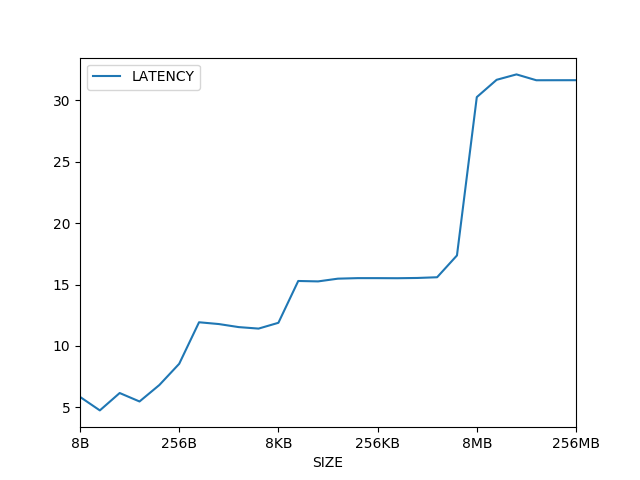

#  Assignment: Benchmarking the memory subsystem

## Memory Latency

## Results

### Graph



### Raw Data

Latencies are in nanoseconds (ns).

| SIZE   | LATENCY   | 
|--------|-----------| 
| 8B     | 5.8441105 | 
| 16B    | 4.743495  | 
| 32B    | 6.1596227 | 
| 64B    | 5.469991  | 
| 128B   | 6.812177  | 
| 256B   | 8.541     | 
| 512B   | 11.9254   | 
| 1024B  | 11.778972 | 
| 2KB    | 11.530925 | 
| 4KB    | 11.409424 | 
| 8KB    | 11.882053 | 
| 16KB   | 15.28918  | 
| 32KB   | 15.255216 | 
| 64KB   | 15.478209 | 
| 128KB  | 15.52147  | 
| 256KB  | 15.520678 | 
| 512KB  | 15.514075 | 
| 1024KB | 15.53467  | 
| 2MB    | 15.593261 | 
| 4MB    | 17.370594 | 
| 8MB    | 30.27253  | 
| 16MB   | 31.682251 | 
| 32MB   | 32.1225   | 
| 64MB   | 31.645473 | 
| 128MB  | 31.648167 | 
| 256MB  | 31.650078 | 


## Code

```rust
const NUM_LOOPS_1: usize = 100_0000;
const NUM_LOOPS_2: usize = 10_0000;
const NUM_LOOPS_3: usize = 1_000;
const NUM_LOOPS_4: usize = 100;

const START_SIZE: usize = 1;
const UP_TO: usize = 26;

use std::fmt;
use std::fs::File;
use std::io::Write;
use std::time::Instant;

struct SIZE {
    n: usize,
}

impl fmt::Display for SIZE {
    fn fmt(&self, f: &mut fmt::Formatter<'_>) -> fmt::Result {
        let size = self.n * 8;

        if (64 - size.leading_zeros()) <= 11 {
            write!(f, "{}B", size)
        } else if (64 - size.leading_zeros()) <= 21 {
            write!(f, "{}KB", size / 1024)
        } else if (64 - size.leading_zeros()) <= 31 {
            write!(f, "{}MB", size / (1024 * 1024))
        } else if (64 - size.leading_zeros()) <= 41 {
            write!(f, "{}GB", size / (1024 * 1024 * 1024))
        } else {
            write!(f, "{}", size)
        }
    }
}
pub struct List<T> {
    head: Link<T>,
}

type Link<T> = Option<Box<Node<T>>>;

struct Node<T> {
    elem: T,
    next: Link<T>,
}

impl<T> List<T> {
    pub fn new() -> Self {
        List { head: None }
    }

    pub fn pop(&mut self) -> Option<T> {
        self.head.take().map(|node| {
            self.head = node.next;
            node.elem
        })
    }

    pub fn push(&mut self, elem: T) {
        let new_node = Box::new(Node {
            elem: elem,
            next: self.head.take(),
        });

        self.head = Some(new_node);
    }

    pub fn iter(&self) -> Iter<'_, T> {
        Iter { next: self.head.as_ref().map(|node| &**node) }
    }
}

impl<T> Drop for List<T> {
    fn drop(&mut self) {
        let mut cur_link = self.head.take();
        while let Some(mut boxed_node) = cur_link {
            cur_link = boxed_node.next.take();
        }
    }
}

pub struct Iter<'a, T> {
    next: Option<&'a Node<T>>,
}

impl<'a, T> Iterator for Iter<'a, T> {
    type Item = &'a T;
    fn next(&mut self) -> Option<Self::Item> {
        self.next.map(|node| {
            self.next = node.next.as_ref().map(|node| &**node);
            &node.elem
        })
    }
}

fn do_read(size: usize) -> f32 {
    let mut nums = List::new();

    (0..size).for_each(|_| {
            nums.push(1u64);
        });
    // nums.shuffle();

    let mut sum = 0u64;
    let mut num_loops = 0;

    let time_taken =  {
        if size <= (4096 * 4) {
            num_loops = NUM_LOOPS_1;

            let now = Instant::now();

            for _ in 0..NUM_LOOPS_1 {
                for n in nums.iter() {
                    sum = sum + n;
                }
            }
            now.elapsed().as_secs_f32()
        } else if size <= (4096 * 4 * 4) {
            num_loops = NUM_LOOPS_2;
            
            let now = Instant::now();
            for _ in 0..NUM_LOOPS_2 {
                for n in nums.iter() {
                    sum = sum + n;
                }
            }
            now.elapsed().as_secs_f32()
        } else if size <= (4096 * 4 * 4 * 4) {
            num_loops = NUM_LOOPS_3;
            let now = Instant::now();
            for _ in 0..NUM_LOOPS_3 {
                for n in nums.iter() {
                    sum = sum + n;
                }
            }
            now.elapsed().as_secs_f32()
        } else {
            num_loops = NUM_LOOPS_4;
            let now = Instant::now();
            for _ in 0..NUM_LOOPS_4 {
                for n in nums.iter() {
                    sum = sum + n;
                }
            }
            now.elapsed().as_secs_f32()
        }
    };

    dbg!(&sum);

    (time_taken * 10e9) / (size * num_loops) as f32
}

fn main() {
    let mut latencies = vec![];
    for i in 0..UP_TO {
        let multiplier = 2f32.powi(i as i32);
        let size = (START_SIZE as f32 * multiplier) as usize;

        let latency = do_read(size);
        println!(
            "{}:\t{:?} nanoseconds",
            SIZE { n: size },
            latency
        );

        latencies.push((SIZE {n:size}, latency));
    }

    
    let mut file = File::create("results.csv").unwrap();
    writeln!(&mut file, "SIZE,LATENCY").unwrap();

    for (s, r) in latencies {
        writeln!(&mut file, "{},{}", s, r).unwrap();
    }

}
```